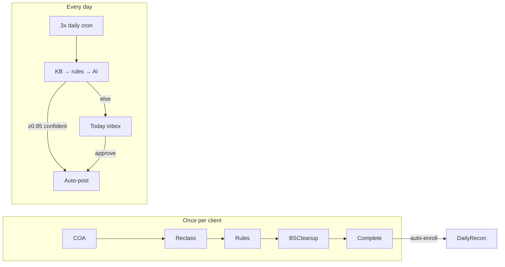

# Daily Recon at Scale — Enterprise Plan

> **Next feature after BS cleanup.** Historical cleanup gets each client to a clean baseline; daily recon keeps them there with minimal human touch. Target: **one manager clears exceptions across 300+ clients in 1–2 hours per day.**

---

## The two-mode product

| Mode | When | Who | Output |
|------|------|-----|--------|
| **Historical cleanup** | Once per client (onboarding) | Bookkeeper | Clean COA, reclass, bank rules, BS wizard, QA gate |
| **Daily recon** | Every business day | Worker + manager triage | Auto-categorized transactions; exceptions → Today |



**Hard rule continuity:** Same guards as BS cleanup — no silent posts, hard-block payroll/tax/owner draws, idempotent line processing, respect human categorizations outside uncategorized accounts.

---

## What already exists (scaffold — do not rebuild)

| Asset | Path | Status |
|-------|------|--------|
| Worker pipeline | `lib/daily-recon.ts` | KB → bank_rules → AI; dry-run default |
| Schema | `scripts/migration_31_daily_recon.sql` | `daily_review_queue`, `processed_qbo_lines`, `daily_recon_runs` |
| Cron | `app/api/cron/daily-recon/route.ts` | Bounded concurrency (5 parallel) |
| Per-client UI | `/today`, `/today/[clientId]` | List + drill-down table |
| Admin enroll | `/admin/daily-recon` | Manual opt-in |
| Queue API | `/api/daily-recon/queue/[id]` | Approve / reject / ask_client → QBO |
| Runbook | `docs/DAILY_RECON.md` | Go-live checklist |

**Gap for scale:** UI is **per-client drill-down**. A manager with 300 clients cannot open 300 pages. Need a **fleet exception inbox** and **bulk triage**.

---

## Scale math (why the UX must change)

Assumptions for a mature fleet:

- 300 enrolled clients
- ~30 new bank-fed lines/client/day → 9,000 lines/day
- After cleanup, **bank rules + KB auto-clear ~92–97%** → 270–720 exceptions/day fleet-wide
- Manager target: **≤2 hours** → ~6–12 seconds per exception max

That only works if:

1. **Most clients show zero pending** (collapsed in UI)
2. **Exceptions group by vendor pattern** — one approve clears 40 identical Starbucks lines across 8 clients
3. **Keyboard-first bulk actions** — not row-by-row clicks
4. **Anomalies surface first** — manager never hunts for the dangerous rows

---

## Enterprise architecture

### 1. Auto-enrollment bridge (cleanup → daily)

When `complete-cleanup` fires (or BS wizard deliver + senior review approve):

```typescript
// On cleanup complete:
client_links.daily_recon_enabled = true
client_links.last_synced_at = cleanup_range_end  // start delta from cleanup window end
audit_log: daily_recon_enrolled_auto
```

Optional: require `cleanup_completed_at` AND `bank_rules` count ≥ N before auto-enroll (safety gate).

Kanban: client moves from `review` → **Active / Monthly** (new column or `client_status=active`).

### 2. Worker fleet (300 clients, 3× daily)

**Cron schedule** (already in `vercel.json`): `0 13,17,21 * * *` UTC.

**Processing model:**

```
Wave 1: clients 1–50   (5 parallel × 10 batches)
Wave 2: clients 51–100
...
Wave 6: clients 251–300
```

Per client budget: ~90s max (QBO fetch + classify + optional auto-post). 50 clients × 90s / 5 parallel ≈ 15 min per wave. Six waves ≈ **90 min** — fits one cron window with headroom.

**Future (500+ clients):** Supabase Queues or Inngest — one message per `client_link_id`, worker pool of 10–20, dead-letter on QBO auth failure.

### 3. Classification pipeline (unchanged tiers, stricter auto bar)

| Tier | Source | Auto-execute? |
|------|--------|---------------|
| 1 | Vendor KB | Yes if ≥0.95 + uncategorized + no anomaly |
| 2 | `bank_rules` (from reclass) | Yes if target valid in live COA |
| 3 | Claude AI | Yes only ≥0.95; else queue |
| 4 | Web search | Queue only in v1; optional ≥0.92 later |

**Never auto-execute:** hard-block patterns (payroll, tax, owner draw), closed period, reconciled lines, anomaly flags, amount > `auto_approve_threshold` (per-client, default $500).

**Learning loop:** Every manager approval → `POST /api/bank-rules/upsert` (same as reclass review). Tomorrow the rule catches it — exception count drops.

### 4. Manager Command Center (`/today` redesign)

Replace flat client list with **three-pane command center**:

```
┌─────────────────────────────────────────────────────────────┐
│  TODAY · Fleet exceptions                                    │
│  287 clear · 13 need review · 2 paused · 4 anomalies        │
├──────────────────┬──────────────────────────────────────────┤
│ CLIENT HEATMAP   │  UNIFIED EXCEPTION INBOX                  │
│ (compact rows)   │  (all pending, all clients)               │
│                  │                                            │
│ ● Acme Painting  │  ▼ GROUP: AMAZON → Office Supplies (12)  │
│   0 pending      │     [Approve all 12]  Acme, Beta, ...      │
│ ● Beta Co        │  ▼ ANOMALY: Duplicate $5000 — Gamma LLC   │
│   3 pending ⚠    │     [Review] [Reject]                      │
│ ● Gamma LLC      │  ▼ Single: NEW VENDOR "Zelle payment"      │
│   1 pending      │     [Approve] [Pick account ▾] [Ask client]  │
└──────────────────┴──────────────────────────────────────────┘
```

**Pane A — Client heatmap (left, 280px)**

- One row per enrolled client (assigned to me / all for lead)
- Badge: pending count, anomaly dot, paused flag, last sync age
- Click row → filter inbox to that client
- **Collapse zero-pending** by default ("Show 287 clear clients")

**Pane B — Unified inbox (center, primary)**

- Single query: `daily_review_queue WHERE decision='pending' ORDER BY anomaly DESC, amount DESC`
- **Group mode** (default): cluster by `(normalize(vendor), suggested_account_id)`
- **Flat mode**: power-user table with keyboard nav
- Bulk actions: Approve group, Reject group, Ask client (batch email stub)

**Pane C — Detail drawer (right, on select)**

- QBO transaction context, AI reasoning, rule that almost matched
- Account override dropdown
- "Remember as bank rule" checkbox (default on for approve)

### 5. Bulk approve API (new)

```
POST /api/daily-recon/bulk
Body: {
  action: "approve" | "reject" | "ask_client",
  queue_ids: string[],           // explicit set
  // OR pattern bulk:
  vendor_pattern?: string,
  suggested_account_id?: string,
  client_link_ids?: string[],    // scope
  attest: true
}
```

- Serial QBO writes per client realm (rate limit aware)
- Idempotency via `processed_qbo_lines`
- Max 100 per request; UI chunks larger groups
- Audit: one `audit_log` row per bulk with count + pattern

### 6. Manager vs bookkeeper permissions

| Action | bookkeeper | lead/admin |
|--------|------------|------------|
| View assigned clients' queue | ✓ | ✓ (all) |
| Approve/reject own clients | ✓ | ✓ |
| Bulk approve cross-client pattern | — | ✓ |
| Unpause auto-paused client | — | ✓ |
| Change auto-execute threshold | — | ✓ |
| Enroll/unenroll daily recon | — | ✓ |

### 7. Anomaly engine (expand for manager trust)

Current: duplicate_same_day, round_number.

**Phase B additions** (each → always queue, never auto):

- `new_vendor` — no KB/rule/reclass history
- `unusual_amount` — >3σ from vendor mean (per client, rolling 90d)
- `stale_period` — txn in closed books
- `missing_recurring` — expected monthly vendor absent
- `high_value` — > client `auto_approve_threshold`

Store in `daily_review_queue.anomaly_flags`; inbox sorts anomaly-first.

### 8. Monthly close tie-in

Reuse BS cleanup `workflow_mode=monthly_close` lightly:

- Last business day: extended lookback (30d), BS health snapshot (read-only)
- Block month-close if `daily_review_queue` pending > 0 for that client
- Surface on Today: "3 clients blocked for month close"

**Downstream:** cleared Today queue + closed reclass → eligible for **[Month-End Delivery](09-month-end-delivery.md)** (portal publish + client email + AI summary on the 1st).

### 9. Observability (manager oversight)

**Fleet strip on `/today`:**

- Auto-categorized (24h)
- Pending exceptions
- Anomalies
- Paused clients
- Failed runs (last cron)

**`/fleet` extension:** daily recon health column — last run status, pending count, auto-rate 7d.

Alerts (future): Slack/email when `daily_recon_paused` or cron failure rate > 5%.

---

## Data model additions (minimal)

| Change | Purpose |
|--------|---------|
| `daily_review_queue.vendor_pattern_normalized` | Fast GROUP BY for bulk approve |
| `daily_review_queue.bulk_group_key` | Precomputed cluster id per cron run |
| `client_links.daily_recon_enrolled_at` | Track auto vs manual enroll |
| `client_links.daily_auto_approve_threshold` | Per-client $ cap (default 500) |
| View `daily_fleet_summary` | `(client_link_id, pending, anomalies, last_run_at, auto_24h)` — powers heatmap in one query |

No new worker tables — extend migration_54_daily_recon_scale.sql.

---

## Phased delivery

### Phase D0 — Go live scaffold (1 week pilot)

- Apply migration 31 if not applied
- Auto-enroll on `complete-cleanup`
- Cron `dryRun=false` for 5 pilot clients
- Validate auto-rate ≥95% on pilots

### Phase D1 — Fleet summary + heatmap

- `daily_fleet_summary` view
- Redesign `/today` header stats (already partial)
- Collapse zero-pending clients
- Filter: mine / all / paused / anomalies only

### Phase D2 — Unified inbox + grouping

- Cross-client exception query
- Vendor pattern grouping UI
- Keyboard shortcuts (j/k/a/r)

### Phase D3 — Bulk approve API + learning loop

- `POST /api/daily-recon/bulk`
- Approve → `bank_rules/upsert`
- Lead-only cross-client bulk

### Phase D4 — Anomaly expansion + per-client thresholds

- new_vendor, unusual_amount, high_value
- Admin threshold tuning

### Phase D5 — Queue infrastructure (500+ clients)

- Inngest/Supabase Queues per-client jobs
- Decouple cron from worker execution

---

## Success criteria

1. After cleanup, client auto-enrolls — no manual admin step
2. ≥95% of daily lines auto-categorized without human touch (mature clients)
3. Manager opens `/today`, sees **only clients with work** by default
4. Bulk-approving "AMAZON → Office Supplies" clears 12 lines in one action
5. 300-client fleet processes within one cron window (90 min)
6. Manager clears remaining exceptions in **≤2 hours** (measured: pending count → 0)
7. Every approval strengthens `bank_rules` — exception rate trends down week over week

---

## What we do NOT do

- Re-categorize P&L outside uncategorized accounts (respect human edits)
- Auto-post payroll/tax/owner transactions
- Replace BS cleanup wizard for onboarding
- Build a parallel categorization engine (reuse `daily-recon.ts` + reclass tiers)

---

## File map (new work)

```
lib/daily-recon-fleet.ts          — fleet summary queries, group key builder
lib/daily-recon-bulk.ts           — bulk approve executor
app/api/daily-recon/bulk/route.ts
app/api/daily-recon/fleet/route.ts — heatmap + inbox data (single BFF call)
app/today/fleet-inbox.tsx         — unified inbox component
app/today/client-heatmap.tsx      — left pane
app/today/page.tsx                — wire 3-pane layout
scripts/migration_54_daily_recon_scale.sql
```

Integrates with: [`complete-cleanup`](../../app/api/clients/[id]/complete-cleanup/route.ts), [`bank-rules/upsert`](../../app/api/bank-rules/upsert/route.ts), [`lib/daily-recon.ts`](../../lib/daily-recon.ts).
