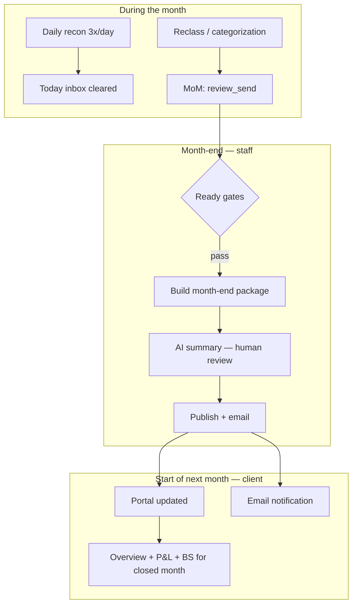

# Month-End (M/E) Client Delivery — Plan

> **At the start of each month**, notify every client that last month's financial statements are ready and closed. One manager can deliver to **hundreds of clients** in a single session: update portal, send email, optional AI business summary.

Integrates with: [Daily Recon](08-daily-recon-at-scale.md) · [BS Cleanup](README.md) · existing MoM kanban · portal · Resend email.

---

## The full lifecycle



| Phase | Who | What |
|-------|-----|------|
| Daily | Worker | Auto-categorize; exceptions → Today |
| Month-end | Bookkeeper | Finish month reclass; clear Today queue |
| M/E delivery | Manager | Bulk publish + email hundreds of clients |
| Day 1 of new month | Client | Email + portal show closed month |

---

## What exists today (reuse)

| Asset | Path | Gap |
|-------|------|-----|
| MoM kanban | `review_send` → `month_closed` | Close only stamps `month_closed_at` — no client comms |
| `POST /close-month` | `app/api/clients/[id]/close-month/route.ts` | No portal/email |
| Portal closed period | `lib/portal-data.ts` → `resolveClosedPeriod()` | Live QBO pull; no frozen snapshot |
| Portal overview narrative | `app/portal/page.tsx` | Heuristic only; comment says "wire Claude" |
| Portal AI context | `lib/portal-ai.ts` | Rich P&L/BS snapshot builder — reuse for M/E summary |
| Resend email | `app/api/portal/support/route.ts` | Pattern for `fetch(api.resend.com/emails)` |
| Cleanup deliver | `cleanup_reports` + `ai_summary` | Same publish + review pattern |
| `client_users` | migration 37 | Portal user emails for delivery |

---

## Ready gates (nothing sends until green)

A client is **deliverable** for month M when ALL pass:

1. **Reclass complete** — `reclass_jobs` for month M with `status=complete`
2. **Today clear** — `daily_review_queue` pending count = 0 for that client
3. **No pause** — `daily_recon_paused = false`
4. **Optional BS check** — latest `cleanup_runs` with `workflow_mode=monthly_close` has `qa_passed_at` OR skipped for clients with clean BS health

Blocked clients show on M/E dashboard with reason — manager fixes or defers.

---

## Month-end package (immutable snapshot)

Don't rely on live QBO at email time — freeze a package when delivering.

### New table: `month_end_packages`

| Column | Purpose |
|--------|---------|
| `client_link_id` | Tenant |
| `period_year`, `period_month` | e.g. 2026, 1 = January |
| `period_start`, `period_end` | Date range |
| `status` | `draft` → `summary_pending` → `ready_to_send` → `sent` → `failed` |
| `pl_snapshot` | JSON — income, expenses, net, top lines |
| `bs_snapshot` | JSON — assets, liabilities, equity, cash |
| `ar_ap_snapshot` | JSON — open totals, overdue |
| `daily_recon_stats` | JSON — auto-categorized count, exceptions cleared |
| `ai_summary` | Plain-language month narrative |
| `ai_summary_reviewed` | Boolean — **required before send** |
| `ai_summary_reviewed_by` | Staff user |
| `portal_published_at` | When portal updated |
| `email_sent_at` | When Resend succeeded |
| `email_message_id` | Resend id for tracking |
| `reclass_job_id` | Link to closed job |
| `created_by`, `sent_by` | Audit |

Unique: `(client_link_id, period_year, period_month)`

### New table: `month_end_delivery_runs` (fleet batch)

One row per manager "Send January to all ready clients" action — tracks batch progress.

---

## AI month summary

**Input** (from `lib/portal-ai.ts` patterns + package snapshot):

- Client name, industry, jurisdiction
- Closed month P&L vs prior month (%, $ deltas)
- Top income/expense movers
- Cash position, AR/AP highlights
- Daily recon: "X transactions auto-categorized, Y reviewed by your bookkeeper"

**Prompt rules:**

- Plain English for a painting contractor owner — no jargon
- 3–5 short paragraphs max
- Call out what changed and why it matters to *their* business
- Never tax/legal advice; never invent numbers
- Deterministic numbers from snapshot only; Claude writes prose only

**Human review required** — same gate as BS cleanup `ai_summary_reviewed`. Manager can edit inline before send.

**Batch generation:** `POST /api/month-end/generate-summaries` — queues AI for all `draft` packages; `after()` chunked (20 clients per wave).

---

## Email (Resend)

**Template:** `month-end-ready`

```
Subject: Your [Month Year] financial statements are ready — [Client Name]

Hi [First name],

Your books for [Month Year] are closed and reconciled. Here's a quick summary:

[AI summary excerpt — first 2 sentences]

View your full statements in the Ironbooks portal:
[CTA button → https://app.ironbooks.com/portal?period=2026-01]

Questions? Reply to this email or use Ask AI in your portal.

— The Ironbooks team
```

**From:** `MONTH_END_FROM_EMAIL` env (or `SUPPORT_FROM_EMAIL`)

**To:** all active `client_users` for that `client_link_id` (owner + spouse if multiple)

**Idempotency:** `email_sent_at` set only after Resend 200; retry safe.

---

## Portal update

On send:

1. Upsert `month_end_packages` as published
2. Set `client_links.latest_closed_period` = `period_end` (denormalized for fast portal load)
3. Portal home (`/portal`) reads package first:
   - Hero: AI summary (reviewed text)
   - Badge: "January 2026 — closed and ready"
   - P&L / BS links default to package period
4. New optional route: `/portal/statements/[year]/[month]` — archived month view

**Notification banner** (first login after send):

> "Your January 2026 statements are ready. [View now]"

Dismissed per-user via `client_users.last_seen_package_id`.

---

## Manager M/E Command Center (`/month-end`)

Single screen for fleet delivery — mirrors Today inbox scale pattern.

```
┌──────────────────────────────────────────────────────────────┐
│  MONTH-END DELIVERY · January 2026                            │
│  287 ready · 13 blocked · 45 already sent · 2 failed         │
├──────────────────────────────────────────────────────────────┤
│  [Generate all summaries]  [Review & send ready (287)]        │
├──────────────────┬───────────────────────────────────────────┤
│ BLOCKED (13)     │  READY TO SEND (242)                       │
│ ● Gamma — 2 Today│  ☑ Acme Painting — summary ✓               │
│   pending        │  ☑ Beta Co — summary ✓                     │
│ ● Delta — no     │  ☐ Epsilon — summary pending               │
│   reclass done   │  ...                                       │
└──────────────────┴───────────────────────────────────────────┘
```

**Workflow (manager, ~1 hour for 300 clients):**

1. **Day 28–31:** Bookkeepers clear Today + finish reclass → cards hit `review_send`
2. **Manager opens `/month-end`:** sees ready vs blocked
3. **One click "Generate summaries"** — AI drafts for all ready (async, poll progress)
4. **Spot-check 5–10** summaries; edit if needed; bulk-approve rest
5. **One click "Send to clients"** — publishes portal + sends email for all `ready_to_send`
6. **`close-month` auto-stamps** `month_closed_at` on send (replaces separate kanban click)

**Bulk send API:**

```
POST /api/month-end/send
Body: { period_year, period_month, package_ids?: string[], send_all_ready?: true }
```

- Bounded concurrency: 10 emails parallel
- Per-client try/catch — one failure doesn't block fleet
- Returns `{ sent: 285, failed: 2, skipped: 13 }`

---

## Automation options

| Mode | When | Who acts |
|------|------|----------|
| **Manual (default)** | Manager clicks send on `/month-end` | Full control |
| **Scheduled** | Cron `0 14 1 * *` (1st of month, 2pm UTC) | Auto-send clients passing all gates + `month_end_auto_send=true` |
| **Reminder only** | Cron 1st of month | Email manager "242 clients ready to deliver" — no auto-send |

Start **manual** for pilot; add scheduled auto-send for mature clients after 3 clean months.

---

## Integration points

### Extend `close-month`

Today: stamps `month_closed_at` only.

After: optionally triggers package build:

```
POST /close-month → build month_end_package (draft) → kanban → month_closed
```

Or: defer close stamp until send (package `sent` sets both).

### Daily recon gate

`GET /api/month-end/readiness?period=2026-01` uses:

- `daily_review_queue` pending count
- `daily_recon_runs` last 24h status

### BS monthly check

Optional gate from `cleanup_runs` where `workflow_mode=monthly_close` and `qa_passed_at` in target month.

### Kanban MoM

`review_send` column → link "Open in Month-End" instead of lone "Mark month closed" button.

---

## Phased delivery

| Phase | Scope |
|-------|-------|
| **M0** | `month_end_packages` migration; package builder from QBO; manual single-client send (pilot) |
| **M1** | `/month-end` fleet dashboard; ready/blocked gates; bulk generate summaries |
| **M2** | Bulk send (portal + Resend email); auto `month_closed_at` on send |
| **M3** | Portal package view + notification banner; archived `/portal/statements/[y]/[m]` |
| **M4** | Scheduled cron reminder + optional auto-send for trusted clients |
| **M5** | PDF attachment (P&L + BS export) in email — reuse cleanup-report PDF patterns |

---

## Success criteria

1. Manager delivers January statements to **300 clients in &lt;2 hours** (mostly automated; human reviews summaries)
2. Client receives email on the 1st (or within 2 business days of month close)
3. Portal shows frozen closed-month data + AI narrative without live QBO lag
4. No send when Today queue has pending items
5. AI summary reviewed by staff before any client sees it
6. Resend failures retried; audit trail per client per month

---

## File map (new work)

```
scripts/migration_55_month_end_delivery.sql
lib/month-end/
  package-builder.ts      — QBO snapshot → package JSON
  ai-summary.ts           — Claude narrative from snapshot
  readiness.ts            — gate checks
  send.ts                 — portal publish + Resend email
app/api/month-end/
  readiness/route.ts      — fleet ready/blocked list
  packages/route.ts       — build draft packages
  generate-summaries/route.ts
  send/route.ts           — bulk deliver
app/month-end/
  page.tsx                — manager command center
  month-end-client.tsx
app/portal/statements/[year]/[month]/page.tsx
```

---

## What we do NOT do

- Send before bookkeeper clears Today exceptions
- Auto-send AI summary without staff review (v1)
- Live QBO pulls in client email (snapshots only)
- Tax advice or filing instructions in AI copy
